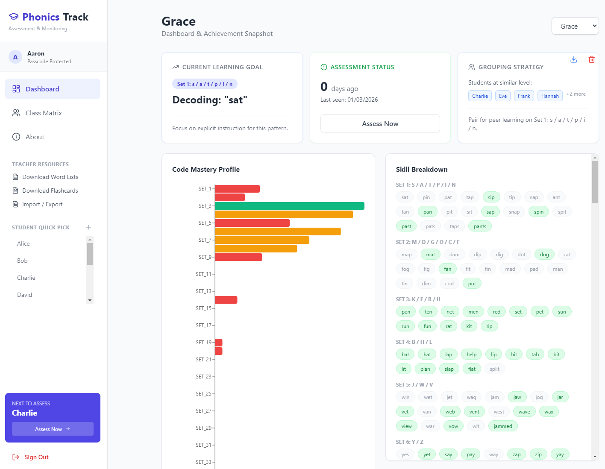

# Phonics Track - Phonics assessment & monitoring tool
A free tool to monitor student achievement in decoding and identify explicit teaching & learning opportunitie and connect early readers with appropriate decodable readers. 

Aligns with 'Phonics Plus' from DET and any other commerical SATPIN sequenced structured synthetic phonics program.

A 100% local, offline-capable reading assessment platform for primary school teachers to track student mastery of phonics skills and high-frequency words. All data is stored locally. No external APIs or internet connection required.

Designed for teachers, E.S, tutors, parents to assess, monitor and track progress in decoding in an efficient and simple system. 

## Curriculum
- Features 35 sets of decodable words, printable if required, following the common S/A/T/P/I/N sequence used by many popular commercial phonics products, including the Victorian Department of Education's own 'Phonics Plus' program. 

## Core Features

- ✅ **Multi-student tracking** per teacher
- ✅ **Phonics skills assessment** (SATPIN through Long Vowels)
- ✅ **Sight words (HFW)** tracking
- ✅ **Student dashboards** with progress visualization
- ✅ **Class matrix overview** with priority sorting
- ✅ **CSV export** (summary, detailed, per-student)
- ✅ **Remove/delete students** from class list
- ✅ **100% offline capable** 
- ✅ **Bundled PDF resources** (Word Lists & Flashcards)

## Data Storage
- **All data stored locally** in browser cache (~5-10 MB available)
- **Persists automatically** across sessions and restarts
- **Survives** logout and app closure
- **Data loss only if** user manually clears browser cache/data
- **For Multi-Device Use:** Export data to CSV and transfer to other computers.

### Import/Export Options
- Full export options to share and backup student achievement data. 

1. **Student Export** - Individual student's complete assessment record
2. **Class Summary** - One row per student with mastery %
3. **Detailed Export** - All students × all skills grid
4. **Import Record** Class and Individual records can be imported

### How to Install
Simply download and run the **phonics.track.exe** file on the right-hand side under 'Releases'.  

### Further Information
https://carrington2000.github.io/phonicsplusapp/

**Created:** Aaron Johnson | **Last Updated:** March 2026
